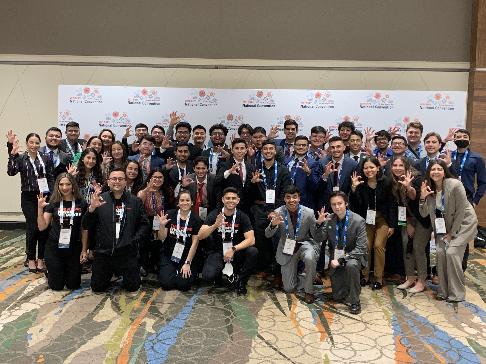
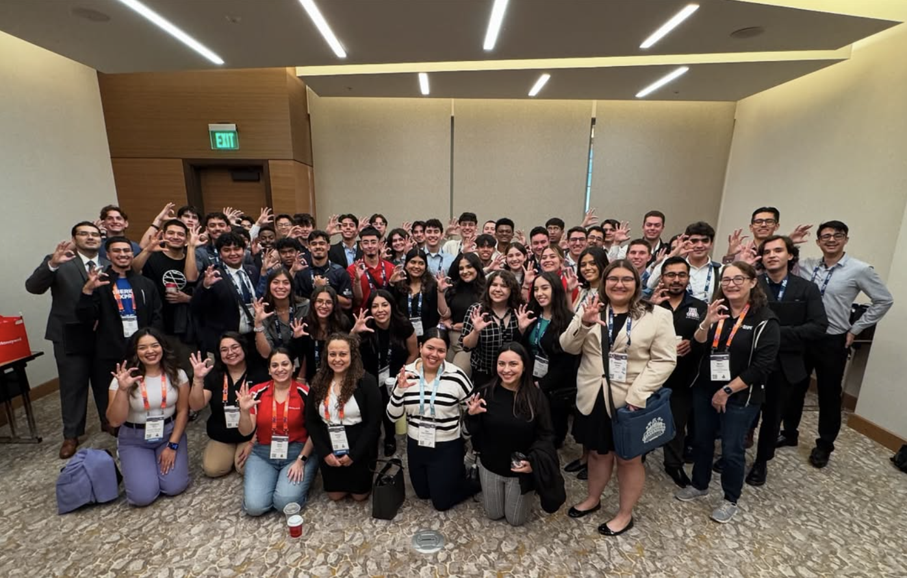
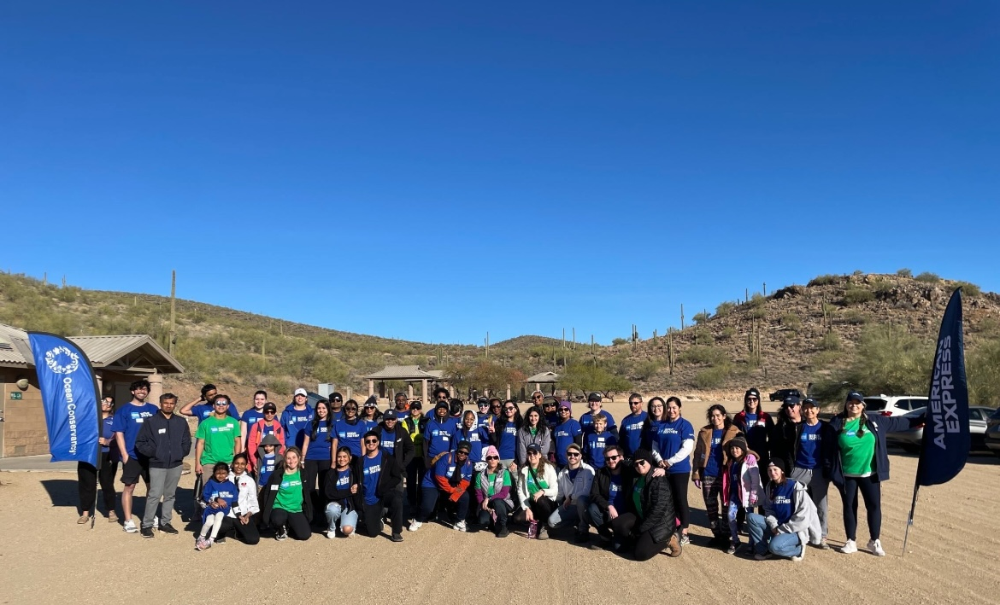
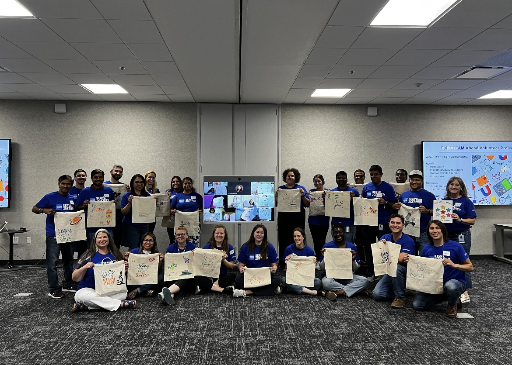



<h2>Society of Hispanic Professional Engineers (<a href="https://shpe.org/" target="_blank">SHPE</a>)</h2>

SHPE is the largest association in the nation for Hispanics in STEM. SHPE changes lives by empowering the Hispanic community to realize its fullest potential and to impact the world through STEM awareness, access, support, and development. 

With the University of Arizona Chapter, and the Phoenix Professional Chapter, we host programs that are designed to raise awareness of and access to STEM among Hispanic communities. We also directly serve K-12, undergraduate, and adult men, and women with experience with up-to-date technology, and improve the retention of Hispanic Engineering and applied sciences students in Arizona. 
  
      
    
SHPE’s growth isn’t slowing down anytime soon. As we continue to expand our membership, programs, and partnerships, we’re guided by a clear mission, a bright vision, and the core values demonstrated by our founders.

 

<h2>Green2Gether & Give2Gether</h2> 
* <b>Green2Gether</b> is dedicated to engaging, educating, and inspiring colleagues in sustainability. 
* We're committed to the challenge of transforming the workplace to foster a sustainable, healthy future for all people and our planet. 

* <b>Give2Gether</b> is a year-round impact programme, focused on donating and volunteering. 

  

 

<h2>Hispanic Origin and Latin-American Employee Network (HOLA)</h2> 
HOLA fosters an environment where its members have the opportunity to reach their maximum potential and advise the business on initiatives relevant to the Hispanic community. Our mission is to drive greater representation of Hispanic or Latino/a leaders within at Amex and help maximize our potential through professional development, networking, opportunities, and supporting our community. 

We do this by: 
* Hosting events and initiatives with a focus on maximizing the value recieved for the first time invested. 
* Supporting community outreach programs that directly have an impact on the Hispanic or Latino/a community. 
* Promoting member development through various growth and networking oppourtunites. 

